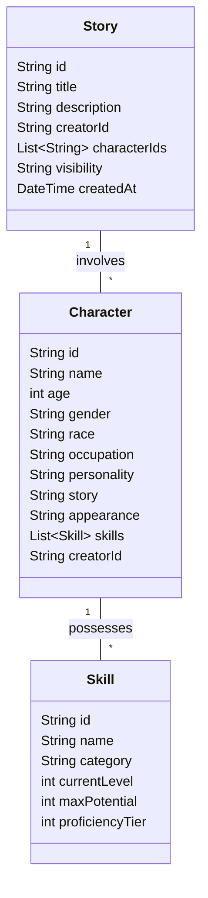

# Stage 3: Data Models Design

This document outlines the data models for Characters, Skills, and Stories as part of the Stage 3: Creator Tools & Character Management.

## 1. Skill Model

The Skill model represents a specific ability or knowledge area a character possesses.

| Field | Type | Description |
|-------|------|-------------|
| `id` | `String` | Unique identifier for the skill. |
| `name` | `String` | Name of the skill (e.g., Swordsmanship, Fire Magic). |
| `category` | `String` | Category of the skill (e.g., Combat, Magic, Social). |
| `currentLevel` | `int` | The character's current level in this skill. |
| `maxPotential` | `int` | The maximum level the character can reach in this skill. |
| `proficiencyTier` | `int` | 0-6 scale (Null to Divine). |

### Proficiency Tiers
- 0: Null
- 1: Novice
- 2: Apprentice
- 3: Skilled
- 4: Expert
- 5: Master
- 6: Divine

## 2. Character Model

The Character model defines the attributes and skills of a character within the lore.

| Field | Type | Description |
|-------|------|-------------|
| `id` | `String` | Unique identifier for the character. |
| `name` | `String` | Full name of the character. |
| `age` | `int` | Age of the character. |
| `gender` | `String` | Gender identity. |
| `race` | `String` | Race or species (e.g., Human, Elf, Android). |
| `occupation` | `String` | Current role or profession. |
| `personality` | `String` | Description of personality traits. |
| `story` | `String` | Backstory or history. |
| `appearance` | `String` | Physical description. |
| `skills` | `List<Skill>` | List of skills the character possesses. |
| `creatorId` | `String` | ID of the user who created the character. |
| `createdAt` | `DateTime` | Timestamp of creation. |

## 3. Story Model

The Story model represents a narrative work, which can contain multiple characters and segments.

| Field | Type | Description |
|-------|------|-------------|
| `id` | `String` | Unique identifier for the story. |
| `title` | `String` | Title of the story. |
| `description` | `String` | Brief summary or premise. |
| `creatorId` | `String` | ID of the user who created the story. |
| `characterIds` | `List<String>` | IDs of characters involved in the story. |
| `visibility` | `String` | `public`, `private`, or `unlisted`. |
| `tags` | `List<String>` | Genre or thematic tags. |
| `createdAt` | `DateTime` | Timestamp of creation. |
| `updatedAt` | `DateTime` | Timestamp of last update. |

## Relationships

