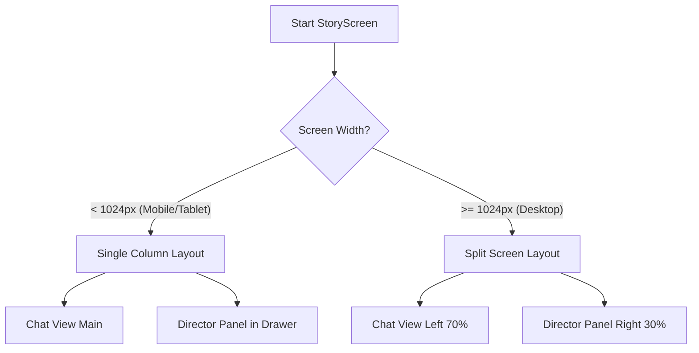

# Loreweaver Accessibility & Responsiveness Strategy

This document outlines the technical specification for making the Loreweaver app multi-device optimized and WCAG AA compliant.

## 1. Responsiveness Strategy

### Breakpoints
We will use a standard set of breakpoints to define device categories:
- **Mobile:** < 600px
- **Tablet:** 600px - 1024px
- **Desktop:** > 1024px

### Layout Implementation
- **`LayoutBuilder` & `MediaQuery`:** Primary tools for conditional rendering.
- **Adaptive Scaffolds:** Use `NavigationRail` for Desktop/Tablet and `NavigationBar` for Mobile.
- **Grid Systems:** Use `GridView` with `SliverGridDelegateWithMaxCrossAxisExtent` for dashboards to automatically adjust column counts.

### Component-Specific Plans

#### Chat Interface ([`story_screen.dart`](lib/screens/story_screen.dart))
- **Mobile:** Full-screen chat, Director's Panel in `endDrawer`.
- **Tablet/Desktop:** Split-screen view. Chat on the left (60-70%), Director's Panel permanently visible on the right (30-40%).
- **Orientation:** In landscape mobile, reduce header height to maximize chat area.

#### Creator Dashboard ([`creator_dashboard.dart`](lib/screens/creator_dashboard.dart))
- **Mobile:** Single column list of cards.
- **Tablet:** Two-column grid.
- **Desktop:** Three or four-column grid depending on width.

#### Character Progression ([`character_progression_screen.dart`](lib/screens/character_progression_screen.dart))
- **Mobile:** Vertical scroll of sections (Stats -> Timeline -> Skills -> Relationships).
- **Desktop:** Multi-pane layout. Stats and Timeline in a left sidebar, Skills and Relationships in a main scrollable area.

---

## 2. Accessibility Strategy

### Color Contrast (WCAG AA)
- **Requirement:** Minimum contrast ratio of 4.5:1 for normal text and 3:1 for large text.
- **Action:** Audit `ThemeData` in [`main.dart`](lib/main.dart).
- **Fix:** Adjust `deepPurple` seed and background opacities. Ensure `UserMessageStyle` background (currently `white.withOpacity(0.1)`) provides enough contrast against the background for the text color used.

### Screen Readers & Semantics
- **Action:** Wrap interactive and informational elements in `Semantics` widgets.
- **Labels:**
    - Chat messages: `Semantics(label: 'Message from ${origin}: ${text}')`.
    - Progress bars: `Semantics(value: '${value}%', label: '${skillName} progress')`.
    - Action buttons: Ensure `tooltip` is present (already partially done, but needs audit).

### Keyboard Navigation
- **Action:** Ensure all interactive elements are reachable via Tab.
- **Focus Management:** Use `FocusNode` for the chat input field to ensure it regains focus after sending a message.
- **Shortcuts:** Implement `Shortcuts` and `Actions` for common tasks (e.g., `Ctrl+Enter` to send, `Esc` to close panels).

### Dynamic Font Scaling
- **Action:** Avoid hardcoded `height` and `width` for containers holding text.
- **Implementation:** Use `ScaledText` or ensure `Text` widgets don't have `maxLines` that cut off content when the user increases system font size. Use `Flexible` and `Expanded` to allow containers to grow.

---

## 3. Technical Specification

### New Utility: `ResponsiveLayout`
Create a wrapper widget to simplify multi-view development.

```dart
class ResponsiveLayout extends StatelessWidget {
  final Widget mobile;
  final Widget? tablet;
  final Widget desktop;

  const ResponsiveLayout({
    required this.mobile,
    this.tablet,
    required this.desktop,
  });

  @override
  Widget build(BuildContext context) {
    return LayoutBuilder(builder: (context, constraints) {
      if (constraints.maxWidth >= 1024) return desktop;
      if (constraints.maxWidth >= 600) return tablet ?? desktop;
      return mobile;
    });
  }
}
```

### Implementation Steps
1. **Theme Audit:** Update [`main.dart`](lib/main.dart) with high-contrast color palette.
2. **Base Layouts:** Refactor `HomeScreen` and `CreatorDashboard` to use `GridView`.
3. **Chat Refactor:** Update `StoryScreen` to support side-by-side view on wide screens.
4. **Semantics Pass:** Add `Semantics` widgets to all custom components in `StoryScreen` and `CharacterProgressionScreen`.
5. **Keyboard Pass:** Add `FocusTraversalGroup` to complex forms.

---

## 4. Mermaid Diagram: Responsive Chat Flow


