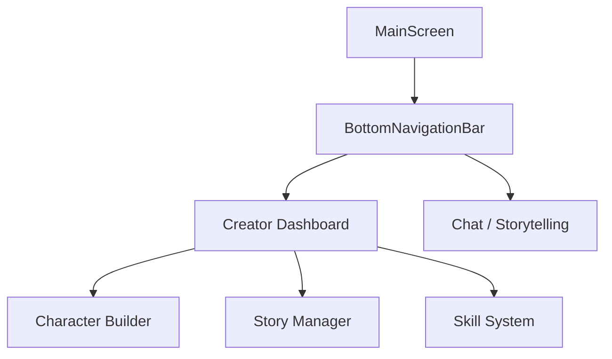

# Stage 3 Design: Creator Tools & Navigation

## 1. Navigation Structure

The app will transition from a single-screen app to a multi-screen app using a `BottomNavigationBar`. The `MainScreen` will act as the root container.

### Navigation Flow


### Implementation Plan for `lib/main.dart`
- Rename `ChatScreen` to `StoryChatScreen`.
- Create `MainScreen` as the new `home` of `LoreApp`.
- Use `IndexedStack` to preserve the state of the Chat and Dashboard.

## 2. Creator Dashboard Design

The Dashboard serves as the central hub for the "Lore Keeper". It follows the "Gritty Noir" aesthetic.

### Layout Components
- **Header**: "THE LORE KEEPER" (Georgia, letter-spaced, brown.shade300).
- **Active Story Card**: A large, featured card showing the current story's progress, title, and a "Resume Journey" button.
- **Quick Actions Grid**:
    - **New Story**: Icon of a quill/inkwell.
    - **New Character**: Icon of a silhouette/mask.
    - **World Notes**: Icon of a scroll.
    - **Library**: Icon of a bookshelf.
- **Recent Characters**: A horizontal scroll of circular avatars with name labels.

### Aesthetic Details
- **Background**: Dark gradient (Black to Brown-900).
- **Cards**: `Colors.black54` with `Colors.brown.shade400` borders (0.5 width).
- **Typography**: Georgia for all headers; Roboto/Sans-serif for dense data if needed, but Georgia preferred for "flavor".

## 3. Character Builder (Placeholder)

A multi-step or long-scroll form for defining character depth.

### Sections
- **Identity**: Name, Age, Race, Occupation.
- **Personality**: Traits, Flaws, Motivations (Text areas).
- **Skills**: A list of skills with a 0-6 tier system.
    - *UI*: Custom slider or "pip" system (e.g., 6 small circles).
- **AI Muse**: A button to "Consult the Oracle" (AI-assisted generation).

## 4. Story Manager (Placeholder)

A list-based view for managing multiple narratives.

### Features
- **Story List**: Cards showing title, genre, and "Last Updated".
- **Management**: Edit world notes, assign characters to stories.
- **Publishing**: Toggle for Public/Private status.

## 5. File Structure Changes

```text
lib/
├── main.dart (MainScreen, LoreApp)
├── core/
│   ├── theme/
│   │   └── app_theme.dart (Move theme logic here)
│   └── services/
│       ├── ai_service.dart
│       └── character_service.dart
└── features/
    ├── dashboard/
    │   ├── screens/
    │   │   └── creator_dashboard.dart
    │   └── widgets/
    │       └── story_card.dart
    ├── chat/
    │   └── screens/
    │       └── story_chat_screen.dart
    ├── character_builder/
    │   └── screens/
    │       └── character_builder_screen.dart
    └── story_manager/
        └── screens/
            └── story_manager_screen.dart
```

## 6. Visual Mockup (Text-based)

```text
+-----------------------------------+
|          THE LORE KEEPER          |
+-----------------------------------+
| [ ACTIVE STORY: The Neon Rain ]   |
| "The city never sleeps, but it    |
|  certainly bleeds..."             |
|             [ RESUME ]            |
+-----------------------------------+
| QUICK ACTIONS                     |
| [ + Story ] [ + Char ] [ Notes ]  |
+-----------------------------------+
| RECENT CHARACTERS                 |
| (O) Jax   (O) Elara  (O) Kael     |
+-----------------------------------+
| [ Dashboard ]         [ Journey ] |
+-----------------------------------+
```
